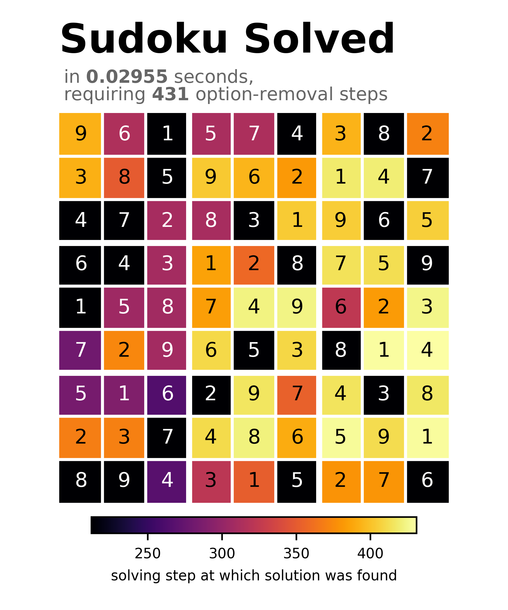

# sudoku

A Sudoku solver written in Python, serving as an exercise project for the `set` datatype. The puzzles to be solved are stored as `.csv` files.

The solver operates by excluding candidates from tiles by removing the values of neighboring tiles that have already been fixed but also by using more elaborate strategies such as X- and Y-Wing. If the solver gets stuck, a bifurcation method is applied to tiles with only two candidates left.

## Installation

Install this library using `pip`.

```shell
$ git clone https://github.com/wyssard/sudoku2.git
$ pip install /sudoku/
```

## Usage

### Default Solver

Access the default solver by importing the `load`, `solve` and `save` functions from `sudoku`:

```python
from sudoku import load, solve, save 
```

and solve an example puzzle from the [example](/examples/) directory:

```python
s = solve(load("/example/evil4.csv"), "grid", "skip")
```

where `"grid"` specifies the formatting of the puzzle in the console. The stepping argument `"skip"` prevents the solver from printing the individual solving steps to the console. Alternatively, every solving step can be printed using `"any"`; if only steps involving more elaborate solving methods are demanded, the stepping argument must be set to `"interesting"`. An optional boolean argument can be given to erase the previous solving step from the console. 

The solved puzzle is then printed to the console as:

```shell 
╭───────────┬───────────┬───────────╮
│ [8][3][5] │ [2][7][6] │ [9][4][1] │
│ [7][9][2] │ [4][1][3] │ [6][5][8] │
│ [1][6][4] │ [5][8][9] │ [7][3][2] │
├───────────┼───────────┼───────────┤
│ [5][2][9] │ [6][4][8] │ [3][1][7] │
│ [3][1][6] │ [7][2][5] │ [8][9][4] │
│ [4][8][7] │ [3][9][1] │ [2][6][5] │
├───────────┼───────────┼───────────┤
│ [6][5][1] │ [8][3][2] │ [4][7][9] │
│ [9][7][8] │ [1][6][4] │ [5][2][3] │
│ [2][4][3] │ [9][5][7] │ [1][8][6] │
╰───────────┴───────────┴───────────╯
```

Save the solved puzzle as a `.csv` file using the `save` function:

```python
save(s, "solved.csv")
```

### Custom Solver

Instead of using the default solver, the `sudoku.generate_solver` function may be used to manually specify the solving methods one likes to use. This solver-generator is based on the idea of extending the solver by implementing custom solving methods. Such solving methods should inherit from the `sudoku.solvingmethods.FmtSolvingMethod` abstract class. An example that makes use of this function to customize the solver can be found in the [example.py](/use/example.py) file. This script also provides a function to plot the solved puzzle using matplotlib. The corresponding result for the puzzle from above can then be rendered as:



## Solving Methods

A brief description of the solving methods used should go here.

## To Do

- [ ] inline documentations
- [ ] solving-method descriptions