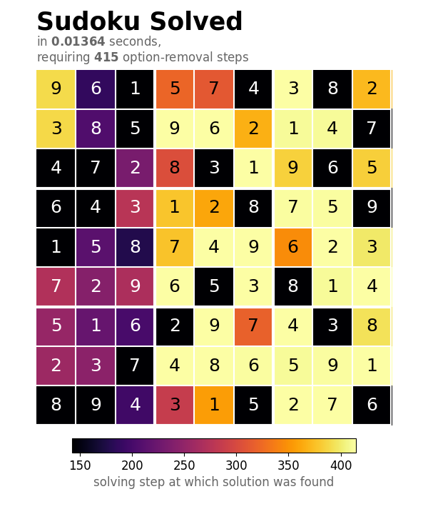

# sudoku-helper

 


A Sudoku solver-generator written in Python. Observe that speed is no priority of this solver (hence displaying the time required to solve the puzzle might be rather hypocritical ;)). The project much rather focuses on providing a simple interface to guide the user step-by-step to the solution of the puzzle. A connection to that interface that allows for printing the individual solving steps to the console has already been implemented. Correspondingly, the solver tries to avoid the use of backtracking algorithms but solves the puzzle by means of algorithms that search for patterns that enable for the immediate exclusion of candidates. The creation of the solver was precisely motivated by the idea of finding such solving algorithms by my own.

The program operates by excluding candidates from tiles by removing the values of neighboring tiles that have already been fixed but also by using more elaborate strategies such as X- and Y-Wing. Only if the solver gets stuck, a bifurcation method is applied to tiles with only two candidates left to minimize backtracking. 

The puzzles to be solved are stored as `.csv` files. The blank tiles are thereby represented by the numerical value of `0`. Some example puzzles taken from [sudoku.com](https://www.sudoku.com) can be found in the [examples](/examples/) directory.


## Installation

Install this library using `pip`.

```shell
$ git clone https://github.com/wyssard/sudoku2.git
$ pip install ./sudoku2/
```

## Usage

This section presents an overview for the possible interactions with this library by either using the built-in solver that guides you through the process of solving the puzzle or by creating a custom solver through the given API.

### Default Solver

Access the default solver by importing the `load`, `solve` and `save` functions from `sudoku`

```python
from sudoku import load, solve, save 
```

This solver interacts with the user by means of a textual consol interface. Solve an example puzzle from the [example](/examples/) directory

```python
s = solve(load("/example/evil4.csv"), "interesting")
```

The 'stepping' argument `"interesing"` causes the solver to print any solving step to the console that made use of a more elaborate solving method. Alternatively, this argument can be set to `"any"` in order to print every solving step or to `"skip"` to prevent the solver from printing the steps completely. An optional boolean argument can be given to erase the previous solving step from the console thus deleting the solving history.

After rendering the individual solving steps to the console, the solved puzzle is printed as:

```shell 
solving step 415: puzzle solved
status: ok
╭───────────┬───────────┬───────────╮
│ [9][6][1] │ [5][7][4] │ [3][8][2] │
│ [3][8][5] │ [9][6][2] │ [1][4][7] │
│ [4][7][2] │ [8][3][1] │ [9][6][5] │
├───────────┼───────────┼───────────┤
│ [6][4][3] │ [1][2][8] │ [7][5][9] │
│ [1][5][8] │ [7][4][9] │ [6][2][3] │
│ [7][2][9] │ [6][5][3] │ [8][1][4] │
├───────────┼───────────┼───────────┤
│ [5][1][6] │ [2][9][7] │ [4][3][8] │
│ [2][3][7] │ [4][8][6] │ [5][9][1] │
│ [8][9][4] │ [3][1][5] │ [2][7][6] │
╰───────────┴───────────┴───────────╯
```

Save the solved puzzle as a `.csv` file using the `save` function

```python
save(s, "solved.csv")
```

Refer to the [docs](/docs/custom_solver.md) to get an in-depth picture of the default solver.

### Custom Solver

Instead of using the default solver, the `sudoku.generate_solver` function may be used to manually specify the solving methods one likes to use. This solver-generator is based on the idea of extending the solver by implementing custom solving methods. Such solving methods should inherit from the `sudoku.solvingmethods.FmtSolvingMethod` abstract class. Observe that this feature is still in development. The creation of custom solver classes is not straight forward at this stage and would require the user to dig into the code of the present solving methods.

An example that makes use of this function to customize the solver can be found in the [use_customsolver.py](use/use_customsolver.py) file. This script also provides a function to plot the solved puzzle using [matplotlib](https://github.com/matplotlib/matplotlib). The corresponding result for the puzzle from above can then be rendered as:



Again, an in-depth picture of the API to create a custom solver with custom frontend is provided by the respective [documentation](docs/custom_solver.md).
