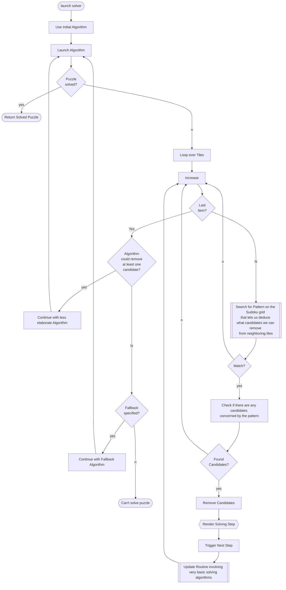

# API Structure

Let us explore the different building blocks a generic solver consists of by going over the key objects found in the respective modules. We shall do this almost hierarchically by starting with the `FmtSolvingMethod` class found in `sudoku.solvingmethods`.

