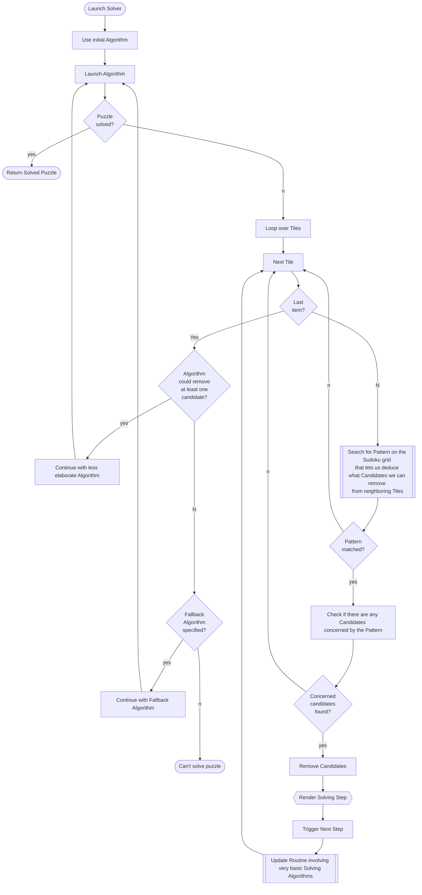

# Solving Process

When working with the [Custom Solver](custom_solver.md) or when making use of the [API](api_guide.md), your interaction with the package goes beyond the simplified functional access and you will be confronted with the objects that, e.g., represent the solving algorithms of the rendering frontend. In order to understand how these objects interact with each other, a basic understanding of the solving procedure, illustrated by the flowchart below, is indispensible.

We come back to some specific nodes of the diagram when discussing the [API](api_guide.md) or the [Custom Solver](custom_solver.md) generator.

## A Word of Caution

Since there are some severe differences between the implemented solving algorithms, the API does not force you (so far) to entirely stick to the prescription suggested by the diagram. For example, you are free to decide whether to implement a loop over tiles or to replace it by a better suiting approach.

!!! note
    Future versions may address this inconvenience by providing a further abstraction that ultimately forces you to stick to the suggested prescription by means of an intermediate abstract class. Since, however, the procedures that are not abstracted are very simple (they come in form of simple conditions or loops), further abstraction may also be omitted completely, to make the code more readable.

## Flowchart

